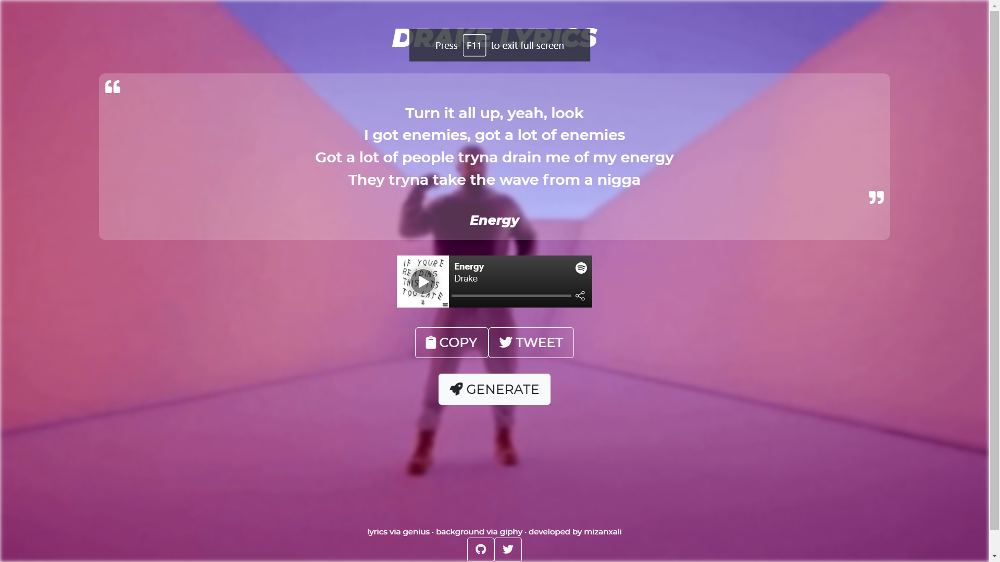

# Drake Lyrics
Randomly generate lyrics from over 170 different songs by the 🐐 Drake to use as your social media captions/bios.

## How I made this app
I used the Genius API to fetch lyrics of all Drake songs on a Node.js server. I then randomly chose one song and extracted 4 random bars from it excluding adlibs between bars.
I also mapped every song to its Spotify unique ID to then dynamically embed the Spotify player for that song each time a lyric is generated.
This data is sent to the frontend which I originally made using EJS templates [(old branch)](https://github.com/mizanxali/drake-lyrics/tree/old-build) but then switched to a standalone React frontend.

